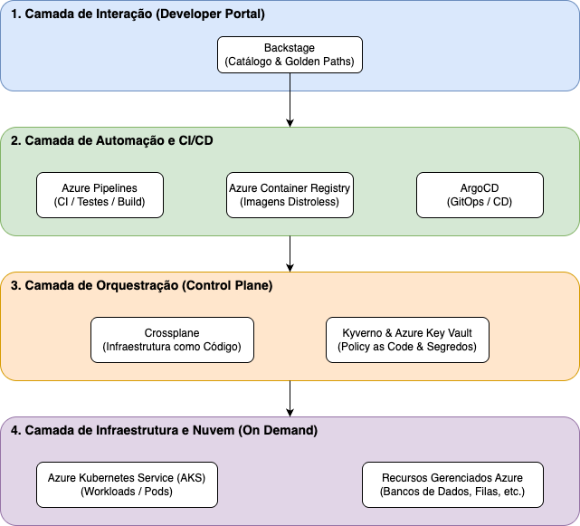

# Trabalho de Conclusao - ARQUITETURA DE SOFTWARE, CIÊNCIA DE DADOS E CYBERSECURITY

Dupla Certificação da PUC-Campinas e PUC-PR
- https://duplapos.puc-campinas.edu.br/cursos-pos-graduacao/arquitetura-de-software

**Sobre**

Ser capaz de arquitetar diferentes soluções tecnológicas para “resolver” os problemas do mundo é uma missão grandiosa. Desenvolva sua capacidade de desenhar soluções sistêmicas, escolher componentes, direcionar estratégias, fazer migrações e implementar práticas de segurança em um curso inovador.

---


- [Trabalho de Conclusao - ARQUITETURA DE SOFTWARE, CIÊNCIA DE DADOS E CYBERSECURITY](#trabalho-de-conclusao---arquitetura-de-software-ciência-de-dados-e-cybersecurity)
- [IMPLEMENTAÇÃO DE INTERNAL DEVELOPER PLATFORM PARA GOVERNANÇA EM AMBIENTE ENTERPRISE](#implementação-de-internal-developer-platform-para-governança-em-ambiente-enterprise)
- [SUMÁRIO EXECUTIVO](#sumário-executivo)
- [PROBLEMATIZAÇÃO](#problematização)
- [JUSTIFICATIVA E OBJETIVO GERAL](#justificativa-e-objetivo-geral)
  - [Justificativa](#justificativa)
  - [Objetivo Geral](#objetivo-geral)
- [FUNDAMENTAÇÃO TEÓRICA](#fundamentação-teórica)
- [PERCURSO METODOLÓGICO DA INTERVENÇÃO](#percurso-metodológico-da-intervenção)
  - [Aplicação Prática de Segurança: Política de Imagens Distroless com Kyverno](#aplicação-prática-de-segurança-política-de-imagens-distroless-com-kyverno)
- [RESULTADOS ESPERADOS](#resultados-esperados)
- [REFERÊNCIAS](#referências)

---

# IMPLEMENTAÇÃO DE INTERNAL DEVELOPER PLATFORM PARA GOVERNANÇA EM AMBIENTE ENTERPRISE

*Eduardo Doval Zenardi Filho*


# SUMÁRIO EXECUTIVO

O presente projeto propõe a arquitetura e implementação de um Internal Developer Platform (IDP) para uma organização multinacional de grande porte. Do ponto de vista dos usuários – compostos por desenvolvedores de software, engenheiros de dados e profissionais de segurança corporativa – o sistema atua como um portal centralizado de self-service para o provisionamento automatizado de infraestrutura e serviços em nuvem. O sistema funcionará em um ambiente de nuvem distribuído globalmente (Microsoft Azure), servindo como a camada de abstração principal entre o código-fonte e a infraestrutura subjacente, como clusters Kubernetes (AKS) e bancos de dados. A principal função da plataforma é reduzir a carga cognitiva dos times de engenharia, oferecendo templates de arquitetura padronizados (Golden Paths) que já contêm as melhores práticas de Infraestrutura como Código (IaC), CI/CD, monitoramento e governança de segurança embutidas.

# PROBLEMATIZAÇÃO
Em ambientes corporativos de escala global, a proliferação de microsserviços e a adoção de múltiplas soluções em nuvem geram uma complexidade operacional insustentável. Atualmente, os times de desenvolvimento gastam uma parcela significativa de seu tempo configurando infraestrutura, gerenciando permissões de acesso e lidando com armazenamento de dados distribuídos, em vez de focar na entrega de valor de negócio. Além da ineficiência e do gargalo operacional, essa falta de padronização arquitetural resulta em graves riscos de Segurança da Informação. Sem uma governança centralizada, aplicações são frequentemente implantadas com configurações de rede inadequadas, falta de rastreabilidade de logs e violações do princípio de privilégio mínimo. A ausência de um fluxo automatizado e validado dificulta a auditoria, a aplicação de patches de segurança em escala e a manutenção de uma postura de nuvem resiliente contra ameaças cibernéticas.

# JUSTIFICATIVA E OBJETIVO GERAL

## Justificativa
A implementação de um Internal Developer Platform (IDP) justifica-se pela necessidade crítica de otimizar a entrega de software e garantir a padronização em um cenário corporativo globalizado e de alta complexidade. Atualmente, a fragmentação de ferramentas e a configuração manual de infraestrutura geram uma alta carga cognitiva para as equipes, resultando em atrasos no time-to-market de novos produtos e na elevação dos custos operacionais.
Para o negócio, o impacto desta intervenção é estratégico e transformador. O IDP centraliza a governança corporativa, assegurando que todas as aplicações e microsserviços sigam padrões rigorosos de arquitetura e segurança desde o início do desenvolvimento (security by design). Além de automatizar o provisionamento em nuvem, a plataforma estabelece diretrizes claras para os ambientes de trabalho — padronizando, inclusive, o uso de assistentes de codificação baseados em inteligência artificial para garantir que o código gerado atenda aos requisitos de compliance da empresa. Dessa forma, o IDP mitiga falhas humanas, reduz vulnerabilidades sistêmicas e permite que as equipes foquem exclusivamente na inovação, impulsionando a competitividade da organização.

## Objetivo Geral
Propor a arquitetura e o modelo de implementação de um Internal Developer Platform (IDP) escalável e segura para o contexto de uma corporação multinacional, visando automatizar o provisionamento de infraestrutura on demand, centralizar a governança e reduzir a carga cognitiva dos times, garantindo segurança na entrega contínua de software.

# FUNDAMENTAÇÃO TEÓRICA
A construção de um Internal Developer Platform (IDP) de nível enterprise requer a orquestração de tecnologias nativas de nuvem e ferramentas consolidadas para garantir escalabilidade, segurança e resiliência. A arquitetura proposta, focada no ecossistema Microsoft Azure e em padrões do Cloud Native Computing Foundation (CNCF), fundamenta-se nos seguintes pilares:

* Portal do Desenvolvedor e Catálogo de Serviços: O Backstage atua como a interface central da plataforma. Ele unifica o catálogo de software corporativo e fornece os Golden Paths. Através de seus Software Templates, abstrai a complexidade inicial de criação de microsserviços, garantindo que novos projetos já nasçam com a arquitetura aprovada.
* Nuvem Enterprise e Orquestração de Infraestrutura: O Microsoft Azure servirá como provedor base, com o AKS (Azure Kubernetes Service) como motor de orquestração de contêineres. O Crossplane é adotado como o motor de Infraestrutura como Código (IaC). Ao invés de fluxos imperativos externos, o Crossplane estende a API do Kubernetes, permitindo provisionar recursos complexos do Azure nativamente.
* Automação, GitOps e Governança de IA: O Azure Pipelines atua como motor de CI, compilando o código, rodando testes automatizados, escaneando vulnerabilidades e publicando as imagens distroless no Azure Container Registry (ACR). O ArgoCD atua como motor de CD (GitOps), garantindo que o estado da infraestrutura no AKS seja idêntico ao declarado nos repositórios. A automação também injeta nativamente arquivos de instrução (como o padrão AGENT.md) na raiz de cada projeto, governando o uso de IA local pelos engenheiros.
* Segurança (Cybersecurity): O Kyverno é adotado como motor de "Política como Código" (Policy as Code), validando recursos automaticamente e bloqueando implantações que violem padrões de segurança ou que não utilizem imagens distroless aprovadas (como Chainguard). O Azure Key Vault gerencia segredos de forma segura, integrado ao AKS através do Secrets Store CSI Driver.


 
# PERCURSO METODOLÓGICO DA INTERVENÇÃO

A arquitetura do Internal Developer Platform (IDP) será baseada no princípio de separação de responsabilidades, garantindo baixo acoplamento e alta coesão. A plataforma será dividida em quatro camadas principais independentes:
1.	Camada de Interação (Developer Portal): Uma interface unificada onde os desenvolvedores podem descobrir serviços, consultar documentações e solicitar o provisionamento de novos recursos por meio de Golden Paths.
2.	Camada de Orquestração (Control Plane): Recebe as requisições via uma estrutura RESTful, traduzindo as intenções dos desenvolvedores em comandos de automação baseados em manifestos do Kubernetes processados pelo Crossplane.
3.	Camada de Automação e CI/CD: Responsável pela execução (pipelines no Azure Pipelines e sincronização via ArgoCD). Uma inovação desta camada é a injeção automatizada de padrões de IA nos repositórios gerados, padronizando as instruções locais para assistentes de codificação das equipes.
4.	Camada de Infraestrutura e Nuvem (On Demand): Onde os recursos reais (clusters AKS, bancos de dados, redes no Azure) são provisionados dinamicamente via código, permitindo escalabilidade horizontal.



Figura 1:  Modelo de Arquitetura Base

## Aplicação Prática de Segurança: Política de Imagens Distroless com Kyverno

Para ilustrar a mitigação de riscos de segurança no cluster (AKS), a plataforma utiliza o Kyverno para garantir que o princípio de Security by Default seja respeitado. Abaixo, apresenta-se o manifesto declarativo utilizado para bloquear qualquer implantação que não utilize as imagens distroless padronizadas da Chainguard, reduzindo drasticamente a superfície de ataque e as vulnerabilidades (CVEs):

```yaml
apiVersion: kyverno.io/v1
kind: ClusterPolicy
metadata:
  name: require-chainguard-distroless
  annotations:
    policies.kyverno.io/title: "Exigir Imagens Distroless (Chainguard)"
    policies.kyverno.io/category: "Pod Security / Supply Chain"
    policies.kyverno.io/severity: "high"
    policies.kyverno.io/description: >-
      Esta política garante que todas as cargas de trabalho no cluster
      utilizem exclusivamente imagens distroless aprovadas para 
      minimizar vulnerabilidades e otimizar o tempo de inicialização.
spec:
  validationFailureAction: Enforce
  background: true
  rules:
    - name: check-image-registry
      match:
        any:
        - resources:
            kinds:
              - Pod
      validate:
        message: "Deploy bloqueado pelo IDP: Apenas imagens distroless aprovadas (cgr.dev/chainguard/*) são permitidas neste ambiente."
        pattern:
          spec:
            containers:
              - image: "cgr.dev/chainguard/*"
            =(initContainers):
              - image: "cgr.dev/chainguard/*"

Análise e Mitigação de Riscos
•	Risco 1: O IDP se tornar um Ponto Único de Falha (SPOF). Mitigação: Desenhar o Control Plane em um ambiente de alta disponibilidade, utilizando múltiplos nós e zonas de disponibilidade na nuvem Azure.
•	Risco 2: Rejeição dos desenvolvedores (baixa adoção). Mitigação: Tratar o IDP como um produto (Platform as a Product), envolvendo os usuários finais no desenho dos templates e garantindo que a plataforma reduza o tempo de setup local em vez de adicionar burocracia.
```

 
# RESULTADOS ESPERADOS

A implementação do Internal Developer Platform (IDP) deverá promover uma transformação na cultura de engenharia, na postura de segurança e na eficiência financeira da organização. Espera-se alcançar os seguintes resultados:

* Padronização e Aceleração via Golden Paths: A adoção de "caminhos pavimentados" reduzirá a carga cognitiva dos times. Ao iniciar novos microsserviços a partir de templates validados, projeta-se uma redução no lead time e um aumento na frequência de deploys. A padronização abrange desde a infraestrutura até as instruções locais para assistentes de codificação de IA.
* Maximização da Segurança com Imagens Distroless: A padronização das esteiras de CI/CD para utilizar exclusivamente imagens distroless (como Chainguard) garantirá aplicações secure by default. Espera-se uma redução drástica na superfície de ataque e mitigação de vulnerabilidades (CVEs). A redução do tamanho das imagens otimizará o tráfego de rede e acelerará a escalabilidade horizontal.
* Visibilidade Arquitetural e Prevenção de Retrabalho: O catálogo unificado do IDP fornecerá uma visão clara de todo o ecossistema de software existente. Isso evitará que times distintos desenvolvam soluções redundantes, eliminando a competição interna por escopo e economizando milhares de horas de força de trabalho (workforce).
* Governança Financeira (FinOps): A plataforma atuará como centralizador de telemetria de custos. Através do tagueamento automatizado da infraestrutura, a empresa terá uma noção exata de seus gastos (cloud spend e workforce), permitindo ajustes proativos e a eliminação de recursos ociosos.


# REFERÊNCIAS
* BEYER, B. et al. Site Reliability Engineering: How Google Runs Production Systems. Sebastopol: O'Reilly Media, 2016.
* CHAINGUARD. Distroless Container Images: Securing the Software Supply Chain. Disponível em: https://www.chainguard.dev/unchained/what-are-distroless-images. Acesso em: 9 mar. 2026.
* CNCF - Cloud Native Computing Foundation. Cloud Native Landscape. Disponível em: https://landscape.cncf.io/. Acesso em: 9 mar. 2026.
* CROSSPLANE. The Cloud Native Control Plane. Documentação oficial. Disponível em: https://crossplane.io/docs/. Acesso em: 9 mar. 2026.
* KYVERNO. Kubernetes Native Policy Management. Documentação oficial. Disponível em: https://kyverno.io/docs/. Acesso em: 9 mar. 2026.
* MICROSOFT. Arquitetura do Azure Kubernetes Service (AKS). Microsoft Learn. Disponível em: https://learn.microsoft.com/pt-br/azure/* aks/concepts-clusters-workloads. Acesso em: 9 mar. 2026.
* MICROSOFT. Integração do Azure Key Vault com o AKS via Secrets Store CSI Driver. Microsoft Learn. Disponível em: https://learn.* microsoft.com/pt-br/azure/aks/csi-secrets-store-driver. Acesso em: 9 mar. 2026.
* SKELTON, M.; PAIS, M. Team Topologies: Organizing Business and Technology Teams for Fast Flow. Portland: IT Revolution Press, 2019.
* SPOTIFY. Backstage: An open platform for building developer portals. Disponível em: https://backstage.io/docs/overview/what-is-backstage. Acesso em: 9 mar. 2026.
    
 

